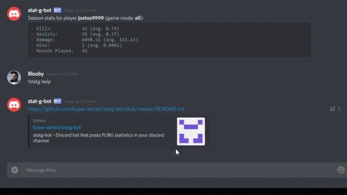

# StatG - PUBG Statistics Discord Bot

[](https://travis-ci.org/kuper-adrian/statg-bot)
[](https://coveralls.io/github/kuper-adrian/statg-bot?branch=master)
[](https://david-dm.org/kuper-adrian/statg-bot?view=list)

StatG is an open source, self-hosted discord bot that can post PUBG statistics in your discord channel!



**Disclaimer:** StatG is a hobby project for the purpose of learning JavaScript, Node.js, Docker, CI and CD. While the bot works and I personally use it, I can give no guarantees about reliabilty or further development. So use it with care ;)

## Commands

* `!statg register PUBG_PLAYER_NAME [REGION_NAME]` 
  Links your PUBG player name to your Discord account and enables you to fetch your stats.
  The optional argument `REGION_NAME` specifies the region of the player. If omitted the default region is used which can be set using the `region` command (see below). For a list of available regions, also see `regions` command.
* `!statg stats [GAME_MODE]` Shows your current season stats (if you have registered yourself). **Optional** `GAME_MODE` arguments are:
    * `solo` Stats from third-person solo matches only.
    * `solo-fpp` Stats from first-person solo matches only.
    * `duo` Stats from third-person duo matches only.
    * `duo-fpp` Stats from first-person duo matches only.
    * `squad` Stats from third-person squad matches only.
    * `squad-fpp` Stats from first-person squad matches only.
* `!statg match`
  Shows your and your squads latest match info (all game modes combined).
* `!statg unregister`
  Undoes `register` command.
* `!statg region REGION_NAME`
  Sets the default region used by `register` command. Available regions are:
    * `pc-na`
    * `pc-eu`
    * `pc-ru`
    * `pc-oc`
    * `pc-kakao`
    * `pc-sea`
    * `pc-sa`
    * `pc-as`
    * `pc-jp`
    * `pc-krjp`
    * `xbox-as`
    * `xbox-eu`
    * `xbox-na`
    * `xbox-oc`
* `!statg help`
  Displays help about commands.
* `!statg version`
  Displays version of the stat-g bot.
* `!statg status`
  Displays the current status of the PUBG api.

## Installation

To run the bot locally on your machine, you will need:

 - Node.js ([Download-Link](https://nodejs.org/en/))
 - A PUBG API key (obtainable from [here](https://developer.playbattlegrounds.com/))
 - A discord bot token + client id (get them [here](https://discordapp.com/login?redirect_to=/developers/applications/me))
 - Add the bot to your server by opening the following link and logging in
 ```
 https://discordapp.com/oauth2/authorize?&client_id=YOUR_CLIENT_ID&scope=bot&permissions=0
 ```
 (replace `YOUR_CLIENT_ID` with the client id of your bot)

**IMPORTANT:** Keep the discord token and pubg api key secret.

After that, everything else is straightforward:
1. Clone this repo or download it as `.zip`-file and unpack it to a folder of your liking
2. Open a terminal and navigate to the project folder
3. Run the bot with the commands
```
npm install
node ./src/bot.js discordToken=TOKEN_HERE pubgApiKey=API_KEY_HERE
```
(replace `TOKEN_HERE` and `API_KEY_HERE` with the respective values)

For easier starting during development you can add a file named `auth.json` to the `src` directory with the following contents:
```json
{
  "pubgApiKey": "API_KEY_HERE",
  "discordToken": "TOKEN_HERE"
}
```
Since this file will contain your secret tokens and keys **you will have to make sure to keep this file secret too**. Once created you can run the bot with
```
node ./src/bot.js runConfig=debug
```
or, even easier in case you have `nodemon` installed, with
```
npm run debug
```

### Running in Docker

Alternatively you can run the bot inside a docker container. For now you will have to build the image by yourself using the `Dockerfile` of this repo. You will also need to get PUBG API key and Discord token as described above.

1. Clone this repo or download it as `.zip`-file and unpack it to a folder of your liking
2. Open a terminal and navigate to the project folder
3. Build the image using `docker build -t statg-bot:latest .`
4. Start the container using the command
```
docker run statg-bot discordToken=TOKEN_HERE pubgApiKey=API_KEY_HERE
```
(again replace `TOKEN_HERE` and `API_KEY_HERE` with the respective values)

To persist data there are two volumes you can mount to: `/statg/data` (contains SQLite-DB-File) and `/statg/logs` (contains log file). A `docker-compose.yml` file could look like this:
```yaml
version: '3'
services:
  statg-bot:
    restart: always
    image: statg-bot:latest
    container_name: statg-bot
    entrypoint: 
    - "node"
    - "./src/bot.js"
    - "discordToken=TOKEN_HERE"
    - "pubgApiKey=API_KEY_HERE"
    volumes: 
    - "YOUR_DATA_VOLUME_HERE:/statg/data"
    - "YOUR_LOGS_VOLUME_HERE:/statg/logs"
```

## Contributing

All contributions are generally welcomed and make me happy ;) Before coding you should get yourself Node.js, npm (which comes with Node.js) and the api keys/discord tokens as described under __Installation__. For code editing I can recommend Visual Studio Code, but feel free to use any code editor you like.

If you want to make doubly sure that your pull request will be accepted, you can run the unit tests inside the ```test``` directory with ```npm t``` or ```npm test```. By running ```npm run lint``` you can also make sure that your code is fulfills the Airbnb js conventions used in this project. Additionally there is the ```npm run coverage``` script that calculates the test coverage.

## License
MIT
